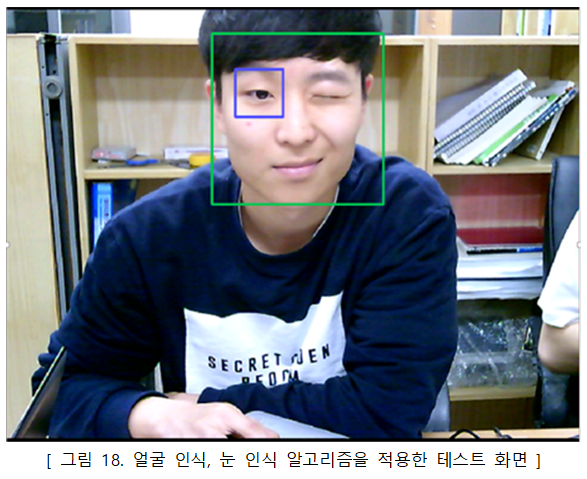
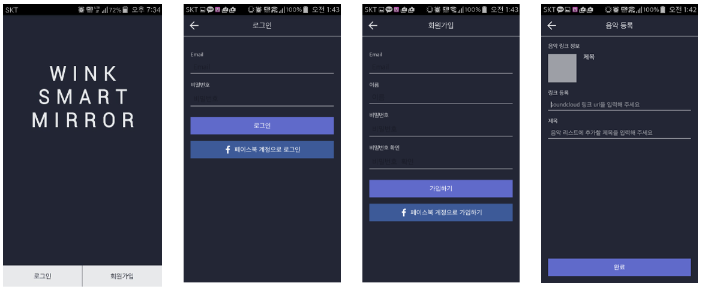

# SmartMirror

### 수강과목 : 캡스톤 디자인2(4학년 2학기 졸업작품)

### 프로젝트 개요 :  
하루에 한번 이상 꼭 보는 거울에서 아이디어를 얻어 IoT를 접목 시켜 삶에 편리함을 주는 스마트 거울 개발.  
거울을 보며 노래를 듣고, To-Do 리스트, 날씨, 날짜 등 생활정보를 얻을 수 있도록 구현.  
스마트 거울 용, 사용자 용 Android 애플리케이션 2개와 개인정보를 저장하고 Android 애플리케이션과 통신할 수 있는 Server 구성.

### 기간 : 2016.03 ~ 2016.06

### 주요 기능 :
- 스마트 거울 Android(Java) App
	- Android OS가 탑재 되어 있는 [ODROID-C2][1] 보드에서 Android 애플리케이션을 실행
	- 스마트 거울 모니터 패널과 hdmi 연결하여 화면과 음성 출력
	- 웹캠과 Android openCV 를 이용하여 사용자 안면 검출
	- Android openCV의 [lbpcascade_frontalface][2]와 [haarcascade_eye][3]를 이용하여 윙크를 판별하는 알고리즘 구현
	- 마이크와 [Google TTS][4] 를 사용하여 음성 인식 및 제어 구현
	- 모니터 패널, 원웨이 필름, 유리를 이용하여 거울에 To-Do 리스트, 날씨, 날짜, 스마트폰 푸시알림을 띄움
	- 조명변화에 취약한 얼굴인식 알고리즘 이미지에 [Histogram Equalization][5] 알고리즘을 적용하여 해결

- 사용자 Android(Java) App
	- 사용자별 제공하는 정보가 다르기 때문에 **회원제 시스템** 도입
	- 스마트 거울에 날씨 정보를 제공하기 위한 **위치 설정**
	- **To-Do 리스트** 작성하여 스마트 거울에 정보 제공
	- **Google Cloud Messaging** 을 사용하여 사용자 스마트폰의 푸시알림 정보를 스마트 거울에 push
	- 주소명을 위도, 경도 데이터로 변환하기 위해 **Daum Local API** 적용
	- 날씨 정보를 얻기 위한 **OpenWeatherMap API** 사용
	- 사용자 노래 등록 편의를 위한 **SoundCloud API** 적용
	- 페이스북 계정 로그인을 사용하기 위한 **Facebook API** 적용

- Server
	- 스마트 거울, 사용자 Android 애플리케이션과 **HTTP 통신** 을 하기 위해 **php로 API 구현**
	- 데이터 저장과 관리를 위한 **MySQL** 데이터 베이스 사용
	- 수월한 서버 개발 및 관리를 위해 [닷홈][6] 무료 호스팅 사용

#### **사용 기술** :  
- H/W : `ODROID-C2`
- S/W : `Android Java`, `php`, `MySQL`, `Android openCV`  

#### **사용 툴** : `Android Studio`, `Sublime Text2`

#### [시연영상][7]

#### [보고서][8]

### SCREEN SHOT
-------

- 스마트 거울 H/W  
   

- Histogram Equalization 적용  
  

- 윙크 인식 알고리즘 적용 모습  
  

- 스마트 거울 Android App  
  

- 사용자 Android App  
  

[1]: https://www.hardkernel.com/main/products/prdt_info.php?g_code=G145457216438
[2]: https://github.com/opencv/opencv/blob/master/data/lbpcascades/lbpcascade_frontalface.xml
[3]: https://github.com/opencv/opencv/blob/master/data/haarcascades/haarcascade_eye.xml
[4]: https://developer.android.com/reference/android/speech/tts/TextToSpeech
[5]: https://www.math.uci.edu/icamp/courses/math77c/demos/hist_eq.pdf
[6]: https://www.dothome.co.kr/
[7]: https://www.youtube.com/watch?v=P2LmrTozXKo&t=0s&list=PLeeQUsIypApzirs2K54nDy5Q4RPufhjTp&index=2
[8]: document/report.pdf